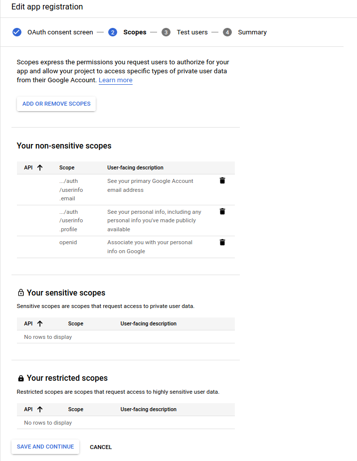
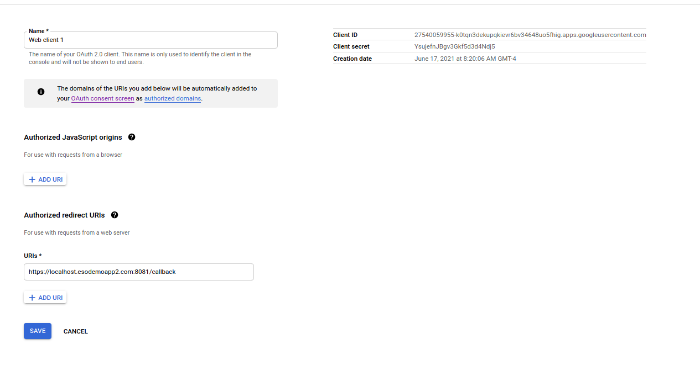
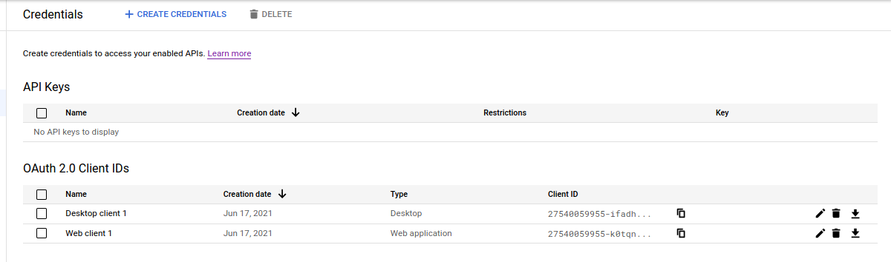
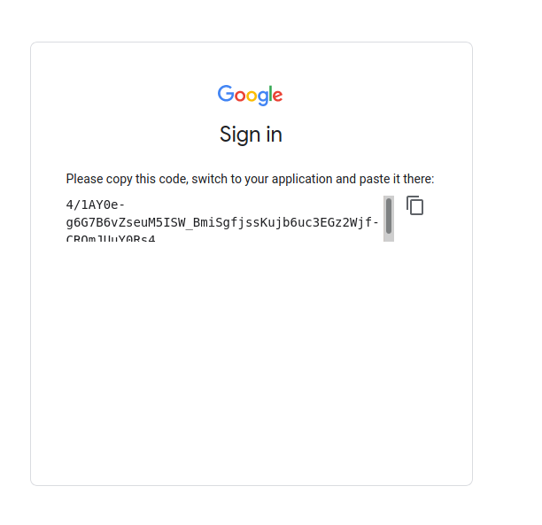

## Google OAuth2 sample app for Web and Installed flows

####  samples provided as-is without warranty

Sample code demonstrating various Auth mechanism for [Google oauth2 flows](https://developers.google.com/identity/protocols/oauth2).  You can use this script as a simple demo for two type of oauth on google:

* [Web Server Application](https://developers.google.com/identity/protocols/oauth2/web-server)
* [Installed Application](https://developers.google.com/identity/protocols/oauth2/native-app)


## Setup GCP Consent 

First create a google GCP project, 

1. navigate to [API & Services --> Oauth2 Consent Screen](https://console.cloud.google.com/apis/credentials/consent?)
2. Select `External` -> Create
3. Enter in the Name, email -> Save and contineu
4. On the "Scopes" screen, select "Add or Remove Scopes"
   Select `userinfo.email`, `userinfo.profile`, `openid`
   If you are a domain admin and you needed your client_id to have sensitive scopes like drive or sheets access, select that here
   
5. Select save and continue and finish off the setup screen

### Oauth2 Web

In the first flow, we will be using the "web application flow".  Please read the how the flow works using the links above. 


First we need the client_id and secret for the web flo.

1. On the cloud console, go to [API & Services -> Credentials](https://console.cloud.google.com/apis/credentials)
2. Select `Create Credentials -> Oauth2 ClientID -> Web Application`
3. Set `Authorized redirect URIs` to `https://localhost:esodemoapp2.com:8081/callback`
   This url will point back to the webserver we will run later on that will receive oauth2 code

   Note that this callback is local:
```bash
$ nslookup localhost.esodemoapp2.com 8.8.8.8
Server:		8.8.8.8
Address:	8.8.8.8#53

Non-authoritative answer:
Name:	localhost.esodemoapp2.com
Address: 127.0.0.1
```

Copy the client_id and secret
  `27540059955-redacted.apps.googleusercontent.com`, `YsujefnJredacted`)

  

4. Edit `oauth2_web.py` and enter in your client_id, secret value
5. Start the webserver  `python3 oauth2_web.py`
6. Open a browser and go to: `https://localhost.esodemoapp2.com:8081/`
7. You should see a login prompt for google
8. After logging in, you will be redirected back and will see your username on the screen

What happened in step 8 is that the you received a `code` back from google and you accessed a simple oauth2 service _as that logged in user_.

If you had earlier specified sensitive scopes like drive or calendar on the consent screen and specified those addition code in the original redirect, you would've been prompted to consent to drive access during logging in.   After logging in, the webserver would've been able to access drive _as you_

### Oauth2 Installed

In the installed application flow, you will not be redirected back using a browser but will receive a code that you will provide back to the application.  Basically, the code that was sent by google in steps 7->8 above is entered in manually by you.

First we need a new clientID

1. On the cloud console, go to [API & Services -> Credentials](https://console.cloud.google.com/apis/credentials)
2. Select `Create Credentials -> Oauth2 ClientID -> Desktop App`
3. Select the "download" button on the far right of the console screen
   
4. Copy the downloaded json file to the repo folder and rename to `client_secret_installed.json`
5. Run the installed application `oauth2_installed.py`
6. You should see a URL 
```
   $ python3 oauth2_installed.py 
https://accounts.google.com/o/oauth2/auth?client_id=27540059955-ifadh7pmspid6uratnfm8a8flc6m0jdk.apps.googleusercontent.com&redirect_uri=urn%3Aietf%3Awg%3Aoauth%3A2.0%3Aoob&scope=https%3A%2F%2Fwww.googleapis.com%2Fauth%2Fuserinfo.email&access_type=offline&response_type=code
```
7. Copy that URL into a new window and login. 
   After logging in, you should see a code window
   
8. Copy that code and paste it back:

```
Enter Auth Code: 4/1AY0e-g6G7B6vZseuM5ISW_BmiSgfjssKujb6uc3EGz2Wjf-CROmJUuY0Rs4
ya29.

{'iss': 'https://accounts.google.com', 'azp': '27540059955-ifadh7pmspid6uratnfm8a8flc6m0jdk.apps.googleusercontent.com', 'aud': '27540059955-ifadh7pmspid6uratnfm8a8flc6m0jdk.apps.googleusercontent.com', 'sub': '101528329863201592331', 'hd': 'esodemoapp2.com', 'email': 'user10@esodemoapp2.com', 'email_verified': True, 'at_hash': 'HWU3uXp_9PHFMKn0SSwT4g', 'iat': 1623933266, 'exp': 1623936866}
{
    "email": "user10@esodemoapp2.com",
    "hd": "esodemoapp2.com",
    "id": "101528329863201592331",
    "picture": "https://lh3.googleusercontent.com/a/default-user=s96-c",
    "verified_email": true
}
```

Once you do that you'll see the output of the token and the user that is logged in.

What this does is acquires your credentials using the installed application, out of band flow (oob) `urn:ietf:wg:oauth:2.0:oob` and then saves the data into a credential file `cred.dat`.

9,  If you rerun the script, it will just use the saved credentials in cred.data and access google apis on your behalf.
