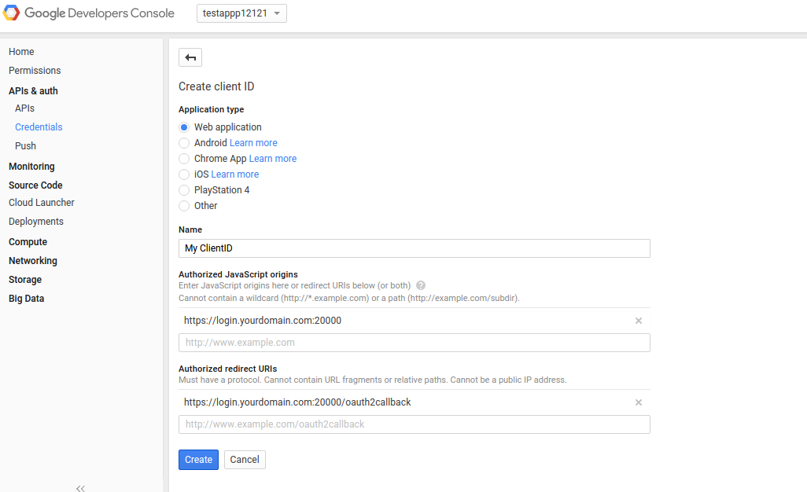
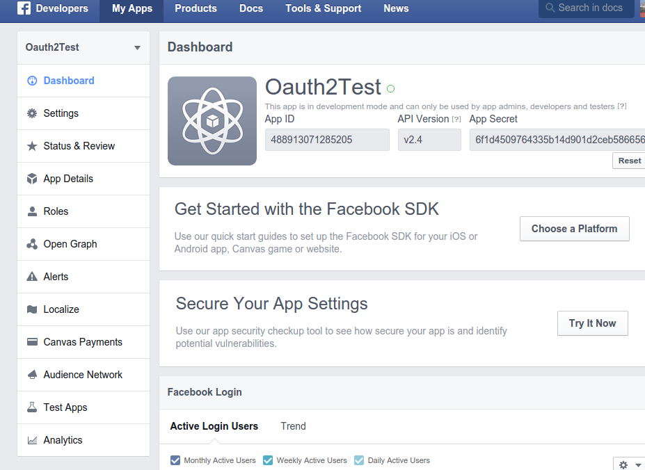

## Google/Facebook Raw OAuth2 Flow

####  samples provided as-is without warranty

Sample code demonstrating various Auth mechanism for Google and Facebook oauth2.  

The sample code below is just the raw request/response flows for oauth2; nothing new except it helps to understand it outside of the libraries.  

The flows are documented here:

* [Google Oauth Flow](https://developers.google.com/identity/protocols/OAuth2WebServer?hl=en)
* [Facebook Oauth Flow](https://developers.facebook.com/docs/facebook-login/manually-build-a-login-flow)

The thing to note is the flow are really the same:  its all the same except details like the scope and the clientID and secrets used.

Please refer to official documentation for usage and additional samples/usage.

***

####Prerequsites

Edit your local hosts file to create an entry for *login.yourdomain.com*.  Ofcourse you can use any domain but the example screenshots below utilizes the following. 
```bash
/etc/hosts
127.0.0.1   login.yourdomain.com
```

#### Google OAuth2

For this oauth flow, you need to install cherrpy and google's oauth2client library.  The client library is *only* used for id_token verification; not the flow.


```
apt-get install curl python2.7 python-pip python-cherrypy3
pip install requests google-api-python-client httplib2 oauth2client
```


#####Create ClientID and Secret
To use the oauth2 flow, you need to generate a clientID and secret.  To do that, create a Google APIs cloud console as described here.  Remember to add on a callback URL to *https://login.yourdomain.com:20000/oauth2callback*

[Google API Console](https://developers.google.com/identity/protocols/OAuth2)  

  


#####Specify the clientID and secret

Edit *oauth2_flow_raw_google.py* and specify the clientID and secret:

```python
client_id = '187776815091-s310o2fn9arkb8sugq9svf7vifao5ul8.apps.googleusercontent.com'
client_secret = 'a0vhgbl21wusklqwK6Nfc1Yf'  
redirect_uri='https://login.yourdomain.com:20000/oauth2callback'
```

#####Lauch webserver and Login

Lauch the script and initiate the auth flow:

```
python oauth2_flow_raw_google.py
```

** http://login.yourdomain.com:20000 **

### Facebook

#####Create ClientID and Secret
To use the oauth2 flow, you need to generate a clientID and secret.  To do that, create a Google APIs cloud console as described here.  Remember to add on a website callback URL to *https://login.yourdomain.com:20000/oauth2callback*

Under [Facebook Developers](https://developers.facebook.com/)  
MyApps --> Create New App (select Advanced)

  


Edit *oauth2_flow_raw_fb.py* and specify the clientID and secret:

```python
redirect_uri='https://login.yourdomain.com:20000/oauth2callback'
client_id='488913071285205'
client_secret='6f1d4509764335b14d901d2ceb586656'   
```

#####Lauch webserver and Login

Lauch the script and initiate the auth flow:

```
python oauth2_flow_raw_fb.py
```

** http://login.yourdomain.com:20000 **